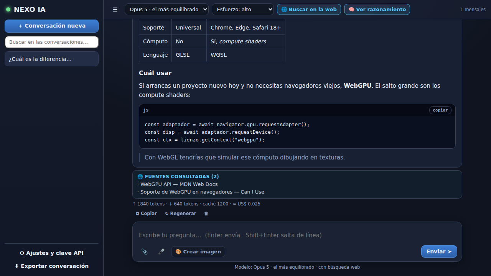

# NEXO IA 🤖

Un asistente de IA propio, en un solo archivo HTML, que corre con **Claude Opus 5** y tu propia clave de la API.
Sin build, sin servidor, sin `npm install`: abres `index.html` y funciona.

## ▶ Cómo arrancar

1. Consigue una clave en [console.anthropic.com](https://console.anthropic.com/settings/keys) (empieza con `sk-ant-`).
2. Abre `ia/index.html` en el navegador.
3. Pega la clave en ⚙ **Ajustes** y guarda. Ya está.

La clave se guarda **solo en tu navegador** (`localStorage`) y viaja únicamente a `api.anthropic.com`.
El uso se cobra a tu cuenta de Anthropic según los tokens que consumas — abajo del todo de cada respuesta
verás cuántos gastaste y el costo aproximado.

## ✨ Qué hace

| | |
|---|---|
| 💬 **Conversación sin tope** | Ni límite de mensajes ni de largo. Cuando el historial llena el contexto, el servidor lo compacta solo y la charla sigue. |
| 🧠 **Razonamiento visible** | Se ve, en un desplegable, el resumen de cómo llegó a la respuesta. |
| 🌐 **Búsqueda web** | Para noticias, precios, versiones o resultados. Lista las fuentes que consultó, con enlace. |
| 🎨 **Crea imágenes** | Botón "Crear imagen". Descarga en SVG o PNG. |
| 👁 **Lee imágenes y PDFs** | Arrastra, pega (Ctrl+V) o adjunta capturas, fotos y documentos. Los PDFs los lee enteros, hasta 25 MB. |
| ✎ **Editar y regenerar** | Cada mensaje tiene su barra: copiar, pedir otra respuesta, corregir tu pregunta y volver a preguntar, o borrar desde ahí. |
| 🎤 **Dictado** | Botón de micrófono para hablar en vez de escribir (en Chrome, Edge y Safari). |
| 📚 **Varias conversaciones** | Se guardan en el navegador, se renombran y se buscan por dentro. Exportables a Markdown. |
| 📱 **Instalable** | Sirviéndola por https se instala como app en el celular o el escritorio, y abre sin conexión. |
| ⚙ **Todo configurable** | Modelo, esfuerzo de razonamiento, tokens por respuesta y las instrucciones del sistema completas. |

### Modelos disponibles

| Modelo | Para qué |
|---|---|
| **Opus 5** (por defecto) | El equilibrio general entre calidad y costo |
| **Fable 5.1** | Lo más capaz, para problemas difíciles de verdad |
| **Sonnet 5** | Rápido y barato para el día a día |
| **Haiku 4.5** | El más ligero, para cosas simples y de mucho volumen |

El **esfuerzo** (bajo → máximo) regula cuánto piensa antes de responder: más esfuerzo da mejores respuestas
en problemas difíciles y cuesta más tokens. `alto` es un buen punto medio.

## 🎨 Sobre las imágenes

Hay dos motores, se eligen en Ajustes:

- **Vectorial (por defecto)** — Claude dibuja la imagen en SVG. No necesita ninguna otra clave, sale nítida a
  cualquier tamaño y se puede descargar como SVG o PNG. Es ideal para ilustraciones, íconos, diagramas,
  escenas planas y logos; no da fotorrealismo.
- **Fotográfico (opcional)** — conecta un proveedor externo de imágenes con endpoint compatible con el de
  OpenAI. Pones URL, modelo y clave del proveedor, y esa clave también queda solo en tu navegador.

Los SVG que llegan del modelo se sanean antes de mostrarse: se eliminan `<script>`, los atributos `on*`
y cualquier referencia externa.

## ⌨ Atajos

| Tecla | Efecto |
|---|---|
| `Enter` | Enviar |
| `Shift` + `Enter` | Salto de línea |
| `Ctrl` + `V` | Pegar una imagen del portapapeles |
| Doble clic en el título | Renombrar la conversación |
| `Esc` | Cerrar Ajustes, o limpiar el buscador |

## 📱 Instalarla en el celular

Los archivos son estáticos, así que basta con servirlos por https. Con GitHub Pages activado en el repo
queda en `https://<tu-usuario>.github.io/new/ia/`: la abres en el celular, le das a "Añadir a pantalla de
inicio" y queda como una app más, con su ícono y sin barra del navegador.

El *service worker* cachea solo el armazón de la app (HTML, ícono, manifest), nunca las respuestas de la
API: esas siempre van a la red.

## 🔧 Detalles técnicos

- Habla directo con la [Messages API](https://platform.claude.com/docs/en/api/messages) por `fetch`, parseando
  el stream SSE a mano. Cero dependencias, cero build.
- Guarda los **bloques de contenido completos** de cada respuesta (texto, razonamiento con su firma,
  resultados de búsqueda, bloques de compactación) y los reenvía tal cual. Guardar solo el texto rompería
  la compactación y el razonamiento encadenado.
- **Degradación progresiva**: si la organización no tiene habilitada alguna función beta (compactación,
  fallbacks del servidor), la API responde `400` y la app reintenta sin ella en vez de mostrar un error.
- Cada modelo acepta parámetros distintos, así que la app los ajusta sola: `output_config.effort` no se
  manda a Haiku 4.5, y el razonamiento usa `adaptive` en los modelos actuales y `budget_tokens` en Haiku.
- `pause_turn` (el bucle de herramientas del servidor llegó a su tope) se reanuda solo, hasta 5 veces.
- El prompt del sistema va con `cache_control` para no pagarlo entero en cada turno.
- Los PDFs viajan como bloques `document` en base64, colocados antes del texto del mensaje.
- Al regenerar o editar se recorta el historial en ese punto, así que la petición nueva sale limpia
  en vez de arrastrar la respuesta descartada.

### Una advertencia sobre publicarlo

Esto está pensado para correr **local**, desde tu propia máquina. Si subes la página a un sitio público y
alguien más la abre, va a usar *su* navegador y *su* clave — pero si dejas tu clave escrita en el código,
queda expuesta a cualquiera. No la escribas en el archivo: úsala siempre desde el diálogo de Ajustes.

## 🚧 Qué *no* hace

La app no le pone límites propios: ni tope de mensajes, ni recortes de las respuestas, ni instrucciones
ocultas — el prompt del sistema es tuyo y lo puedes reescribir entero desde Ajustes.

Lo que sí sigue en pie es el entrenamiento del modelo: Claude a veces se va a negar a cosas por su cuenta,
y eso no se puede desactivar desde el cliente. Si un pedido tuyo choca con eso, la app te lo muestra
tal cual en vez de esconderlo.
