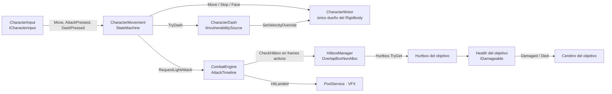

# Arquitectura

## Capas

```
Core  ←  Data  ←  Combat  ←  Controllers / Enemies
```

Cada capa solo conoce a las de su izquierda. `Core` no depende de nada del juego. Así, el combate se puede reutilizar para el jugador y para la IA sin cambios.

## Componentes de un personaje



## Flujo de un golpe

1. `CharacterInput` lanza `AttackPressed`.
2. `CharacterMovement` pregunta al estado actual si `CanAttack`. Si puede, pide `CombatEngine.RequestLightAttack()` y pasa a `Attack`. Si ya hay un golpe en curso, la pulsación se guarda en el buffer.
3. En cada `FixedUpdate`, `AttackTimeline.Step()` avanza un frame.
   - En **Startup**, `AttackState` aplica el avance del golpe (`LungeVelocity`).
   - En **Active**, se llama a `HitboxManager.CheckHitbox()`.
   - Pasada la ventana activa (`IsCancelable`), el buffer encadena el siguiente golpe o permite cancelar con un dash.
4. `HitboxManager` hace `OverlapBoxNonAlloc`. Por cada collider busca su `Hurtbox` en el registro, descarta auto-impactos y objetivos ya golpeados, y llama a `Health.TakeDamage(in DamageInfo, multiplicador)`.
5. `Health` ignora el golpe si el objetivo está muerto, es invulnerable (dash) o del mismo equipo. Si no, resta vida y lanza `Damaged`, y `Died` si llega a 0.
6. El cerebro del objetivo reacciona: aplica el empuje (`Motor.AddKnockback`) y pasa a `HitStun` o a `Dead`.
7. El atacante recibe `HitLanded`: congela su golpe `hitStopFrames` frames y saca el VFX del pool.

## Estados del jugador

| Estado | Moverse | Atacar | Dash | Sale a |
|---|---|---|---|---|
| Idle | ✔ | ✔ | ✔ | Move, Attack, Dash, HitStun, Dead |
| Move | ✔ | ✔ | ✔ | Idle, Attack, Dash, HitStun, Dead |
| Attack | ✘ | buffer | solo en recuperación | Idle/Move al terminar, Dash, HitStun, Dead |
| HitStun | ✘ | ✘ | ✘ | Idle al acabar el aturdimiento |
| Dash | ✘ | ✘ | ✘ | Idle/Move al terminar |
| Dead | ✘ | ✘ | ✘ | — |

## Decisiones

- **OverlapBox por frame en vez de triggers.** Los triggers dependen de que los colliders se crucen entre dos pasos de física, así que a mucha velocidad se saltan golpes (tunneling). Además no se controla en qué frame golpean.
- **Registro de Hurtbox.** Evita `GetComponent` por impacto y permite varias zonas por personaje, como la cabeza con más daño.
- **`AttackTimeline` en C# puro.** La lógica de frames se prueba sin escena y sin Play Mode.
- **Un solo escritor de velocidad.** Si varios scripts escriben `rigidbody.velocity` se pisan entre ellos. El motor combina movimiento, empuje y dash en un único sitio.
- **Eventos de `Health` en vez de llamadas directas.** El sistema de daño no sabe nada de animaciones ni de IA. La interfaz, los sonidos o las estadísticas se pueden suscribir sin tocar el combate.
- **Orden de ejecución.**
  - Los cerebros (`-20`) piden el movimiento antes que el dash (`-10`), y el dash antes que el motor (`0`).
  - Así, todo lo que se pide en un frame se aplica en ese mismo frame.
